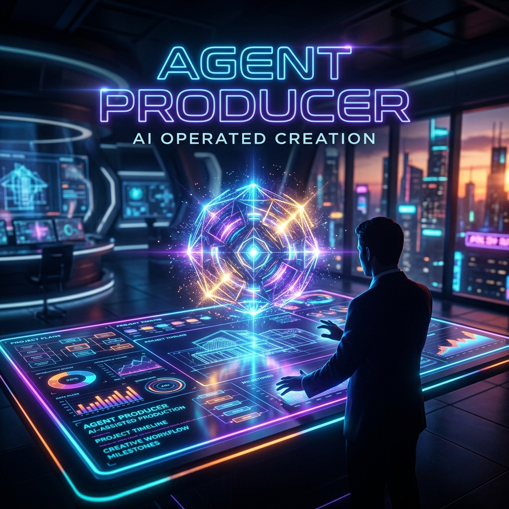

# Agent Producer: AI-Driven Planning & Pitch Generation Assistant



## 概要 (Overview)
**Agent Producer** は、Google Agent Development Kit (ADK) 2.0 と Gemini を活用し、アイデアから企画書、調査、改善提案、発表資料の作成までを支援するマルチエージェントシステムです。

ユーザーが入力した企画案を元に、複数の専門エージェントが協力しながら企画を磨き上げます。また、「Review Gate (Human-in-the-loop)」を挟むことで、AIの生産性とクリエイターの意思決定を高いレベルで融合させ、意図に沿った高品質な企画書とピッチ原稿を高速に生成します。

## 解決したい課題 (Problem)
企画制作において、市場や類似作品の調査、弱点の発見と改善、プレゼン資料の作成には多大な工数がかかります。
AIによるテキスト生成を活用する事例は増えていますが、「すべてをAIに任せると、制作者の本来の意図や情熱からズレてしまう」という課題がありました。

Agent Producerは、**「クリエイターの意図を中心に据えつつ、企画立案から発信までの時間を劇的に短縮する伴走者」** として機能します。

## エージェント構成と機能 (Agent Architecture)
現在（β版）は以下のエージェントとフローが実装されています。

- **Planner Agent**: 抽象的なアイデアを整理し、コア体験やMVPを定義した企画ドラフトを作成します。
- **Research Agent**: 類似作品や市場傾向を調査し、企画の差別化ポイントを補強します。
- **Critic Agent**: 企画の弱点や制作上のリスクを洗い出し、建設的な改善案を提示します。
- **Review Gate (Human Approval)**: 企画ドラフトが作成された段階で一時停止し、ユーザーの承認（Approve/Revise/Reject）を受け付けます。
- **Producer Agent**: 承認された企画を元に、魅力的なキャッチコピーや30秒ピッチ原稿、発表構成を生成します。

## ADK2.0 PlayGroundでの実行方法 (How to Run)

### 前提条件
- Python 3.13 以上
- [uv](https://docs.astral.sh/uv/) (Pythonパッケージマネージャ)

### セットアップ
リポジトリをクローンし、`uv` を用いて依存関係をインストールします。

```bash
uv sync
```

### 実行
ADK2.0 の `InMemoryRunner` を用いたワークフロー（自動生成〜人間による承認〜ピッチ作成）をテストできます。

```bash
uv run python run_workflow.py
```

実行するとターミナル上でエージェントによる企画立案が進み、途中で `=== Review (Approve) ===` として承認待ち状態になります。コード内で指定された承認プロセスを通過すると、最終的なピッチスクリプトが生成されます。

## 今後の展望 (Roadmap)
将来的には、生成されたピッチスクリプトをもとに **Video Agent** が動画生成ツール（Remotion等）と連携し、ショートピッチ動画の自動生成までを一気通貫で支援する計画です。
